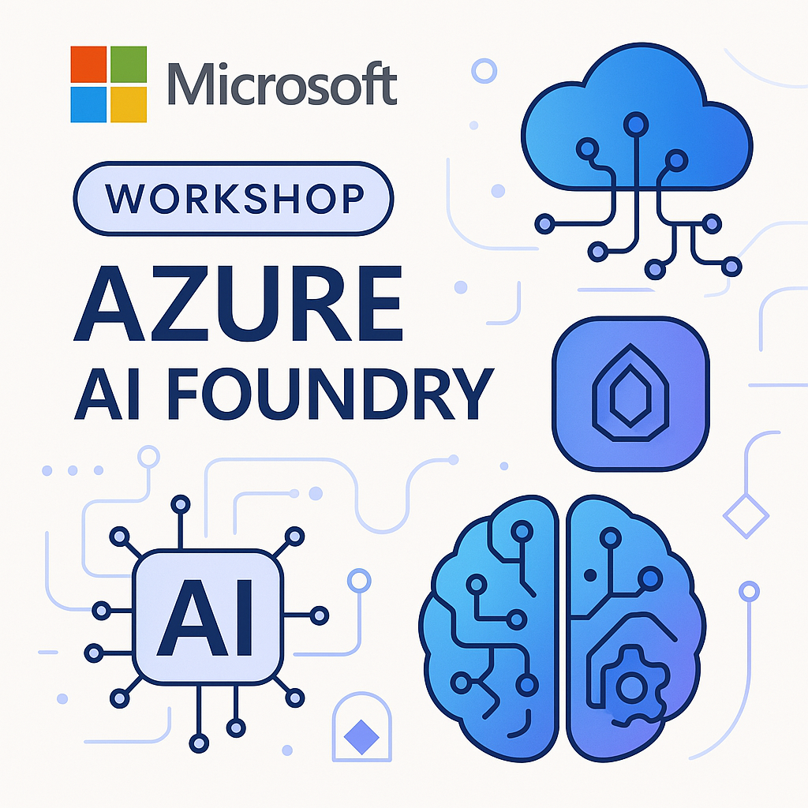

# Azure AI Foundry Workshop

Welcome to the Azure AI Foundry Workshop! This comprehensive hands-on workshop will guide you through the latest capabilities of Azure AI Foundry, Microsoft's unified platform for building, deploying, and managing AI applications.



## 🎯 Workshop Overview

Azure AI Foundry provides a collaborative environment for AI development, offering tools for data preparation, model training, fine-tuning, evaluation, and deployment. This workshop covers everything from getting started to advanced scenarios with practical implementations.

## 📚 Available Languages

This workshop is available in multiple languages:

- **English**: `/labs/english/` - Complete workshop materials in English
- **Português (Brasil)**: `/labs/portuguese/` - Materiais completos do workshop em português brasileiro

## 🚀 Workshop Structure

This workshop provides a complete journey through Azure AI capabilities, structured in five progressive laboratories:

### 🔧 [Lab 1: Connection and First Steps with Azure OpenAI](labs/english/lab1/) | [Lab 1: Conexão e Primeiros Passos](labs/portuguese/lab1/)
**Azure OpenAI Fundamentals**

Master the foundations of Azure OpenAI Service through hands-on exercises covering API configuration, response analysis, embeddings generation, multimodal image processing, and exploration of various LLM models available in Azure AI Foundry.

**Key Topics:**
- Azure OpenAI Service setup and API calls
- Detailed response analysis and parameter tuning (temperature, top_p, tokens)
- Text embeddings for semantic analysis
- Image processing with multimodal models
- Advanced features: Function Calling, Structured Outputs, JSON Mode

### 🧠 [Lab 2: Azure AI Services Ecosystem](labs/english/lab2/) | [Lab 2: Serviços de IA do Azure](labs/portuguese/lab2/)
**Complete AI Services Integration**

Explore the comprehensive suite of Azure AI services beyond OpenAI, learning to integrate speech recognition, natural language processing, computer vision, and content safety into unified workflows.

**Key Services:**
- **Azure AI Speech**: Audio transcription, synthesis, and translation
- **Azure AI Language**: NER, sentiment analysis, key phrase extraction, translation
- **Azure AI Vision + Document Intelligence**: OCR, image analysis, document processing
- **Azure AI Content Safety**: Content moderation and safety filtering

### 📝 [Lab 3: Advanced Prompt Engineering](labs/english/lab3/) | [Lab 3: Engenharia de Prompts](labs/portuguese/lab3/)
**Mastering AI Communication**

Master the art and science of prompt engineering through 8 advanced techniques to optimize AI model interactions and achieve consistent, high-quality results.

**Techniques Covered:**
- Zero-Shot and Few-Shot Prompting
- Chain-of-Thought and Tree of Thoughts
- Meta Prompting and Prompt Chaining
- RAG Integration and Active Prompting
- Best practices for prompt optimization

### 🔨 [Lab 4: AI Frameworks - Semantic Kernel and AutoGen](labs/english/lab4/) | [Lab 4: Frameworks de LLM](labs/portuguese/lab4/)
**Enterprise-Grade Development Patterns**

Explore professional frameworks for building intelligent applications with Semantic Kernel and AutoGen, learning to create plugins, orchestrate agents, and develop complex automation workflows.

**Framework Focus:**
- **Semantic Kernel**: Microsoft's SDK for AI integration with custom plugins
- **AutoGen**: Multi-agent conversational systems and collaboration
- Framework comparison and selection guidance
- Building a complete product analysis system

### 🔍 [Lab 5: RAG Implementation with Azure AI Search](labs/english/lab5/) | [Lab 5: Implementação de RAG](labs/portuguese/lab5/)
**Advanced Information Retrieval and Generation**

Implement a comprehensive RAG (Retrieval-Augmented Generation) system using Azure AI Search and Azure OpenAI, enabling language models to access specific external knowledge beyond their training data.

**Implementation Topics:**
- Complete RAG architecture from documents to responses
- Azure AI Search configuration for vector search
- Document processing, chunking, and embedding storage
- Quality comparison between responses with and without RAG

## 🔧 Prerequisites

### Required
- **Azure Subscription**: Active Azure subscription with appropriate permissions
- **Azure AI Services Access**: Access to Azure OpenAI Service and other AI services
- **Programming Knowledge**: Basic familiarity with Python
- **Development Environment**: VS Code or similar IDE with Jupyter support

### Recommended
- **Azure CLI**: For command-line interactions with Azure
- **Git**: For version control and repository management
- **Basic ML Knowledge**: Understanding of machine learning concepts

## 🛠️ Setup Instructions

### 1. Clone Workshop Materials
```bash
git clone https://github.com/gilbertossoares/ai-foundry-workshop.git
cd ai-foundry-workshop
```

### 2. Environment Configuration
Copy the `.env.example` file to `.env` and configure your Azure credentials:

```bash
cp .env.example .env
# Edit .env with your Azure service credentials
```

### 3. Install Dependencies
```bash
pip install -r requirements.txt
```

### 4. Verify Setup
Run the environment check script:
```bash
python check_environment.py
```

## 🔒 Security & Best Practices

This workshop follows Azure security and AI best practices:

### Security Framework
- **Managed Identity**: All examples use managed identity for authentication where applicable
- **Key Vault Integration**: Secure storage of secrets and connection strings
- **RBAC**: Proper role-based access control configuration
- **Data Privacy**: Compliance with data protection regulations

### Responsible AI Implementation
- **Fairness**: Bias detection and mitigation strategies
- **Reliability & Safety**: Error handling and graceful degradation
- **Transparency**: Explainable AI and decision traceability
- **Privacy**: Data minimization and protection techniques
- **Inclusiveness**: Accessibility and diverse user consideration

## 🆘 Troubleshooting & Support

### Common Issues

**Access and Permission Issues**
- Ensure your Azure account has proper permissions for AI services
- Check service quotas and availability in your Azure region
- Verify API keys and endpoint URLs in `.env` file

**Technical Configuration Issues**
- Use Python 3.8+ with virtual environment
- Install all dependencies from `requirements.txt`
- Check network connectivity and firewall settings

### Getting Help

- [Azure AI Foundry Documentation](https://learn.microsoft.com/azure/ai-foundry/)
- [Azure OpenAI Service Guide](https://learn.microsoft.com/azure/ai-services/openai/)
- [GitHub Issues](https://github.com/gilbertossoares/ai-foundry-workshop/issues)
- [Microsoft Tech Community - Azure AI](https://techcommunity.microsoft.com/category/azure-ai)

## 📄 License and Usage

This project is licensed under the MIT License - see the [LICENSE](LICENSE) file for complete details.

##  Ready to Begin Your AI Journey?

**Choose your preferred language and start exploring:**

### 🇺🇸 English Workshop Materials
**[Begin English Workshop →](./labs/english/)**

### 🇧🇷 Materiais em Português Brasileiro  
**[Iniciar Workshop em Português →](./labs/portuguese/)**

---

**🌟 Transform your understanding of AI and unlock the full potential of Azure AI Foundry!**